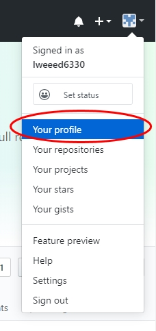
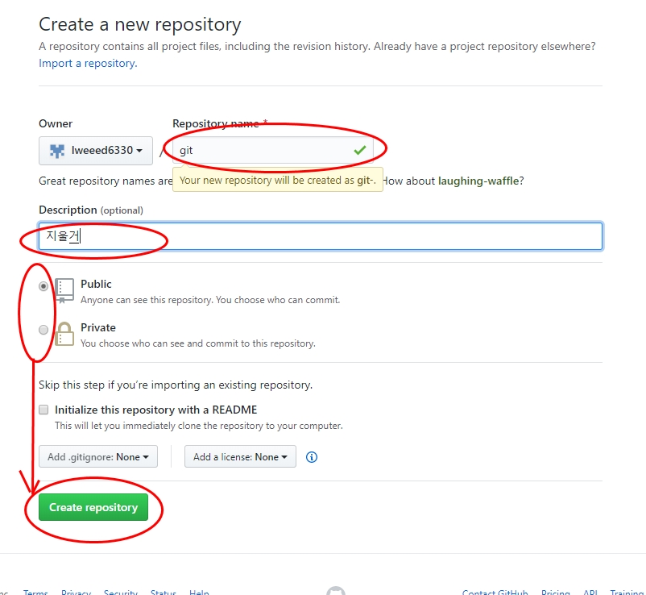
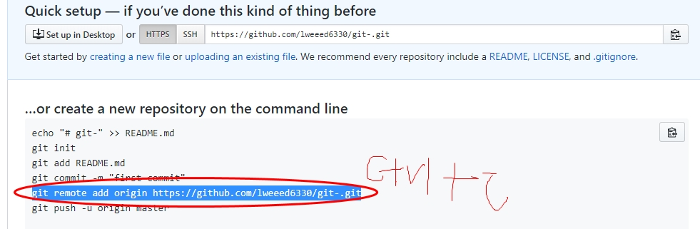

# git 을 배워보자
##  git 설치
### 1. [git-scm.com](https://git-scm.com) 다운로드 버튼을 클릭하고 설치한다(기본값으로 설치)
### 2. [git-scm.com](https://github.com) 으로 이동한다.
### 3. 우측 상단의 **signup** 버튼을 클린한다.
### 4. 회원 가입을 완료하고 등록한 이메일로 이동하여 velified 버튼을 클릭하여 인증한다.

# visual studio code (VScode) 를 설치하자
## 다운로드
### 1. 구글에서 그림과 같이 검색해서 이동한다.

 

### [vscode] (https://code.visualstudio.com/download) 에서 그림과 같이 다운로드 한다.


### vscode 설치시 모든 옵션을 키고 설치한다.

# 프로젝트 시작
## 1.  vsde 에서 작업
1. 작업폴더로 이동하여 새폴더를 01.hello 생성한다.
2. vscode를 열고 **파일 > 폴더열기...**로 폴더를 연다.
3. ![vscode] (./img/c03.jpg) 화면의 1번 아이콘 클릭 후 오른쪽 버튼
(context Menu) 에서 새파일을 선택하여 index.html을 만든다.
4. 아래의 코드를 입력한다.
```html 
<html lang="en">
    <head>
        <meta charset="UTF-8">
        <meta name="viewport" content="width=device-width, initial-scale=1.0">
        <title>hello world</title>
    </head>
    <body>
        <h1>안녕하세요</h1>
        <h2>반갑습니다</h2>
        <a href="//naver.com">네이버</a>
    </body>
</html>
```

## 2. gitthub.com 에서의 작업
1.{깃허브}(https://github.com)로 이동하여 **로그인** 한다.
2. 아래의 그림과 같이 새로운 **repository**를 생성한다.



아래의 사항으로 입력하여 **저장소(repository)** 를 생성한다.



4. 아래의 화면에서 **제일 긴 줄** 을 복사한다.


